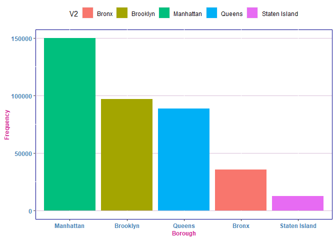
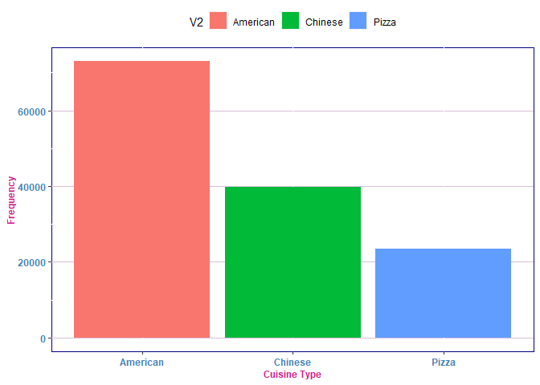
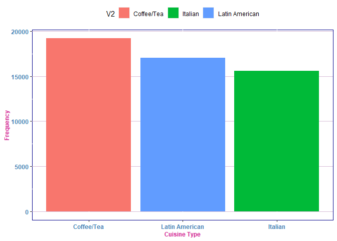
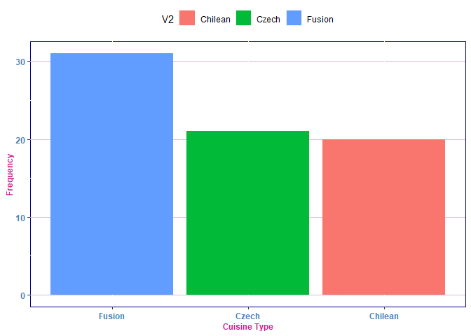
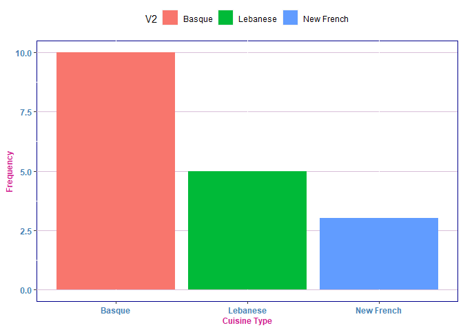

<h2>
Big Data Analysis and Techinques with Food Data Set
</h2>
<blockquote>
Source of Data:
<https://data.cityofnewyork.us/Health/DOHMH-New-York-City-Restaurant-Inspection-Results/43nn-pn8j>
</blockquote>
<p>
The following R packages were used to manipulate the data, strings, and
visual the data.
</p>

``` r
suppressPackageStartupMessages(library(tidyverse))
##########################################################################
#
# This package installs many packages such as: 
#    ggplot2, for data visualisation.
#    dplyr, for data manipulation.
#    tidyr, for data tidying.
#    readr, for data import.
#    purrr, for functional programming.
#    tibble, for tibbles, a modern re-imagining of data frames.
#    stringr, for strings.
#    forcats, for factors.
##########################################################################
```

To illustrate my theme which I created I shall use it in my various
plots to commence the GSS analysis.

``` r
theme1 <- theme(plot.title=element_text(face="bold", size="20", color="slateblue"), axis.title=element_text(face="bold",  size=9, color="violetred"),               axis.text=element_text(face="bold", size=9, color="steelblue"), panel.background=element_rect(fill="white",  color="darkblue"), panel.grid.major.y=element_line(color="thistle",   linetype=1),panel.grid.minor.x=element_blank(), legend.position="top")
```

<h3>
Data Cleanup
</h3>
<p>
After importing the packages data cleanup can now begin.
</p>

``` r
df <- read.csv(file.path("D:","Datasets","FoodDataNYC","FoodDataNYC.csv"))
```

Data Type, and Functional Understanding of Selected Variable

The data output of showed the different structure that is within the
dataset even revealing the numeric, and the factor data types. This
output is really useful because it reveals to others the importance of
understanding the problem fully expressed in this command. However,
there are other useful structure creations such as the following.

``` r
str(head(df))
```

    ## 'data.frame':    6 obs. of  26 variables:
    ##  $ CAMIS                : int  40396037 50014226 50074432 41317594 50018945 41599272
    ##  $ DBA                  : chr  "SMILER'S DELI" "EL GRAN VALLE IV RESTAURANT" "LEGENDARY BAR & GRILL" "MARK FORGIONE" ...
    ##  $ BORO                 : chr  "Manhattan" "Manhattan" "Bronx" "Manhattan" ...
    ##  $ BUILDING             : chr  "532" "1944" "3513" "134" ...
    ##  $ STREET               : chr  "MADISON AVENUE" "AMSTERDAM AVENUE" "EAST TREMONT AVENUE" "READE STREET" ...
    ##  $ ZIPCODE              : chr  "10022" "10032" "10465" "10013" ...
    ##  $ PHONE                : chr  "2126441090" "2123687100" "7188220100" "2129419401" ...
    ##  $ CUISINE.DESCRIPTION  : chr  "Sandwiches" "Latin American" "American" "American" ...
    ##  $ INSPECTION.DATE      : chr  "10/22/2018" "12/13/2017" "01/08/2019" "06/15/2019" ...
    ##  $ ACTION               : chr  "Violations were cited in the following area(s)." "Violations were cited in the following area(s)." "Violations were cited in the following area(s)." "Violations were cited in the following area(s)." ...
    ##  $ VIOLATION.CODE       : chr  "04N" "04L" "04L" "06C" ...
    ##  $ VIOLATION.DESCRIPTION: chr  "Filth flies or food/refuse/sewage-associated (FRSA) flies present in facilityâ\200\231s food and/or non-food ar"| __truncated__ "Evidence of mice or live mice present in facility's food and/or non-food areas." "Evidence of mice or live mice present in facility's food and/or non-food areas." "Food not protected from potential source of contamination during storage, preparation, transportation, display or service." ...
    ##  $ CRITICAL.FLAG        : chr  "Critical" "Critical" "Critical" "Critical" ...
    ##  $ SCORE                : int  39 20 13 12 12 9
    ##  $ GRADE                : chr  "" "" "A" "A" ...
    ##  $ GRADE.DATE           : chr  "" "" "01/08/2019" "06/15/2019" ...
    ##  $ RECORD.DATE          : chr  "12/14/2021" "12/14/2021" "12/14/2021" "12/14/2021" ...
    ##  $ INSPECTION.TYPE      : chr  "Cycle Inspection / Initial Inspection" "Cycle Inspection / Initial Inspection" "Cycle Inspection / Re-inspection" "Cycle Inspection / Initial Inspection" ...
    ##  $ Latitude             : num  40.8 40.8 40.8 40.7 40.8 ...
    ##  $ Longitude            : num  -74 -73.9 -73.8 -74 -74 ...
    ##  $ Community.Board      : int  105 112 210 101 105 108
    ##  $ Council.District     : int  4 7 13 1 4 5
    ##  $ Census.Tract         : int  10200 24100 16400 3900 13700 13200
    ##  $ BIN                  : int  1035744 1062717 2076559 1079166 1023742 1045959
    ##  $ BBL                  : num  1.01e+09 1.02e+09 2.05e+09 1.00e+09 1.01e+09 ...
    ##  $ NTA                  : chr  "MN17" "MN36" "BX52" "MN24" ...

Here the data shows a limited but still comprehensive view of the data.
It leads to a better understanding of the problem.
<h2>
Data Dimensions
</h2>

The dimensions of the dataset are as follows:

``` r
dim(df)
```

    ## [1] 383521     26

<h2>
Location
</h2>

Looking first at Location Variable One can view where most of the
dataset lies in.

``` r
t1 <- table(droplevels(as.factor(df$BORO),exclude="0"))
a <- cbind(t1, row.names(t1))
df1 <- data.frame(a)
df2 <- tidyr::pivot_longer(df1,cols = c("t1"), names_to='variable', values_to="value")
df2$value <- as.numeric(df2$value)
ggplot(df2, aes(x=reorder(V2,-value), y=value, fill=V2)) +
    geom_bar(stat='identity', position='dodge')+
  labs(x= "Borough", y="Frequency")+
  theme1
```



<p>
The next analysis which shall be done is on the cuisine type offered at
such restaurants.
</p>
<h2>
Cuisine Type
</h2>

``` r
t2 <- table(fct_drop(as.factor(df$CUISINE.DESCRIPTION)))
t2 <- sort(t2,decreasing = T)
b <- cbind(t2, row.names(t2))
df3 <- data.frame(b)
df4 <- tidyr::pivot_longer(df3,cols = c("t2"), names_to='variable', values_to="value")
df4$value <- as.numeric(df4$value)
df4$value <- sort(df4$value, decreasing = T)
ggplot(df4[1:3,], aes(x=reorder(V2,-value), y=value, fill=V2)) +
    geom_bar(stat='identity', position='dodge')+
  labs(x="Cuisine Type", y= "Frequency")+
  theme1
```



``` r
ggplot(df4[4:6,], aes(x=reorder(V2,-value), y=value,fill=V2)) +
    geom_bar(stat='identity', position='dodge')+
  labs(x="Cuisine Type", y= "Frequency")+
  theme1
```



``` r
ggplot(df4[82:84,], aes(x= reorder(V2,-value), y=value, fill=V2))+
  geom_bar(stat='identity',position='dodge')+
  labs(x="Cuisine Type", y= "Frequency")+
  theme1
```



``` r
ggplot(df4[85:87,], aes(x=reorder(V2,-value), y=value, fill=V2)) +
    geom_bar(stat='identity', position='dodge')+
  labs(x="Cuisine Type", y= "Frequency")+
  theme1
```


